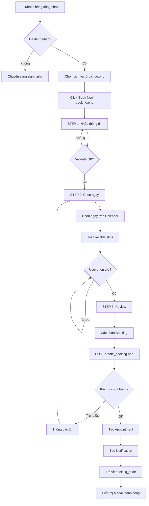
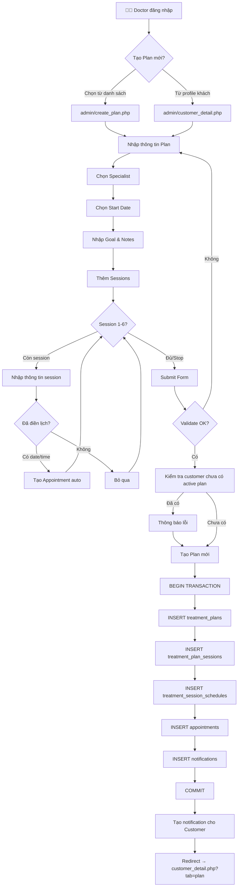
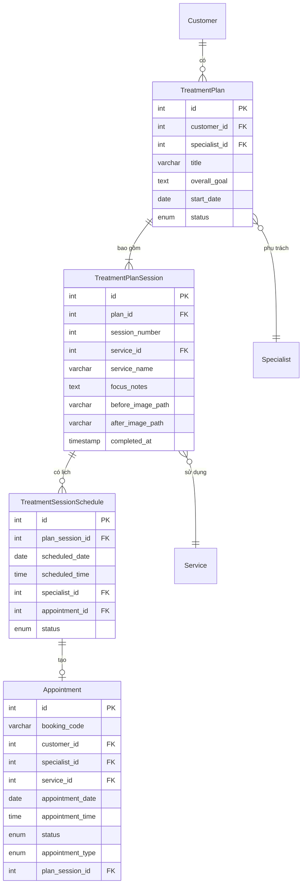
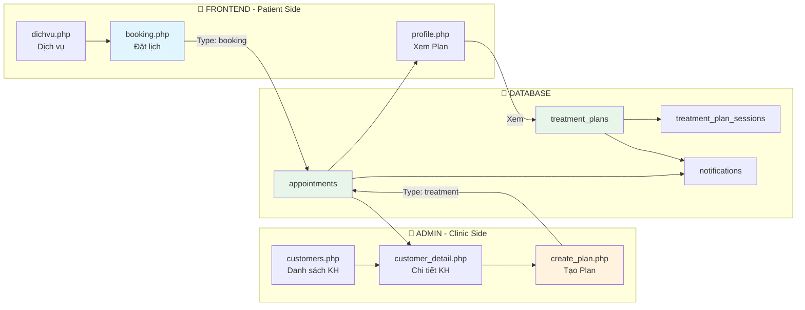
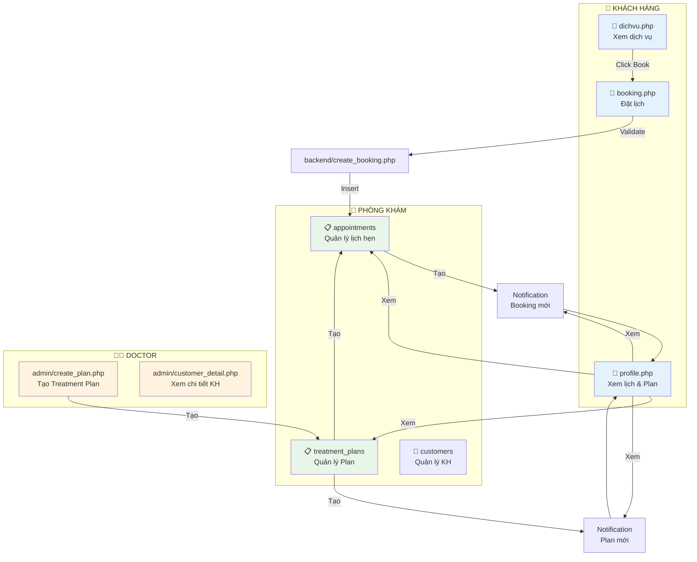

# Luồng Vận Hành Hệ Thống Elysian Skin Clinic

## 1. LUỒNG BOOKING (Đặt Lịch Hẹn)

### 1.1 Tổng Quan Luồng Booking

```
┌─────────────────────────────────────────────────────────────────────────────┐
│                        LUỒNG BOOKING - SƠ ĐỒ TỔNG QUAN                     │
└─────────────────────────────────────────────────────────────────────────────┘

    ┌──────────────┐     ┌──────────────┐     ┌──────────────┐
    │  STEP 1      │     │  STEP 2      │     │  STEP 3      │
    │  Information │ ──► │  Schedule    │ ──► │  Confirm     │
    │              │     │              │     │              │
    │ • Họ tên     │     │ • Chọn ngày │     │ • Review     │
    │ • SĐT        │     │ • Chọn giờ  │     │ • Confirm    │
    │ • Dịch vụ    │     │              │     │ • Success    │
    │ • Chuyên gia │     │              │     │              │
    └──────────────┘     └──────────────┘     └──────────────┘
           │                    │                    │
           ▼                    ▼                    ▼
    ┌──────────────────────────────────────────────────────────┐
    │                    PHÍA SERVER                            │
    │  • Backend: create_booking.php                            │
    │  • Database: appointments, notifications                  │
    │  • Trạng thái: pending → confirmed → completed/cancelled │
    └──────────────────────────────────────────────────────────┘
```

### 1.2 Chi Tiết Từng Bước

#### **STEP 1: Thông Tin & Chọn Dịch Vụ**

| Trường | Mô tả | Validation |
|--------|-------|------------|
| `full_name` | Họ tên khách hàng | Bắt buộc |
| `phone` | Số điện thoại | 10 số, bắt đầu bằng 0 |
| `service_id` | Dịch vụ mong muốn | Bắt buộc |
| `specialist_id` | Chuyên gia | Bắt buộc |

**API gọi:** `../backend/get_services.php`, `../backend/get_specialists.php`

```
Frontend                          Backend
    │                                  │
    ├─ GET services ──────────────────►│
    │◄── JSON: danh sách dịch vụ ─────┤
    │                                  │
    ├─ GET specialists ───────────────►│
    │◄── JSON: danh sách chuyên gia ──┤
    │                                  │
```

#### **STEP 2: Chọn Ngày & Giờ**

| Trường | Mô tả | Validation |
|--------|-------|------------|
| `appointment_date` | Ngày hẹn | Không được chọn ngày quá khứ |
| `appointment_time` | Giờ hẹn | Slot trống của chuyên gia |

**API gọi:** `../backend/get_slots.php?date=YYYY-MM-DD&service_id=X&specialist_id=Y`

```
Backend kiểm tra:
├── Lịch làm việc của chuyên gia
├── Các booking đã có trong ngày
└── Loại trừ slot bận → Trả về available_slots
```

#### **STEP 3: Xác Nhận & Tạo Booking**

**API gọi:** `../backend/create_booking.php` (POST)

**Dữ liệu gửi lên:**
```json
{
  "full_name": "Nguyễn Văn A",
  "phone": "0912345678",
  "service_id": "5",
  "specialist_id": "3",
  "appointment_date": "2026-05-20",
  "appointment_time": "09:00"
}
```

**Server xử lý:**
```
1. Validate tất cả fields
2. Kiểm tra service tồn tại
3. Kiểm tra specialist tồn tại
4. Kiểm tra slot còn trống (tránh trùng lặp)
5. Tạo booking_code: ELY-XXXXXX
6. INSERT vào bảng appointments (status: pending)
7. Tạo notification cho khách hàng
8. Trả về JSON response
```

### 1.3 Trạng Thái Booking

```
┌─────────────────────────────────────────────────────────────────┐
│                    TRẠNG THÁI APPOINTMENT                       │
└─────────────────────────────────────────────────────────────────┘

    ┌──────────┐     ┌───────────┐     ┌──────────────┐
    │ pending  │────►│ confirmed │────►│   completed  │
    │ (chờ)   │     │ (xác nhận)│     │   (hoàn tất) │
    └──────────┘     └───────────┘     └──────────────┘
           │                │
           │                ▼
           │         ┌──────────────┐
           └────────►│  cancelled   │
                     │   (hủy)      │
                     └──────────────┘
```

| Status | Mô tả | Actor có thể thay đổi |
|--------|-------|----------------------|
| `pending` | Chờ xác nhận từ phòng khám | Receptionist |
| `confirmed` | Đã xác nhận, sẵn sàng | Receptionist |
| `completed` | Đã hoàn thành buổi điều trị | Doctor |
| `cancelled` | Đã hủy | Receptionist, Customer |

### 1.4 Mermaid - Booking Flow



### 1.5 Database Schema

```sql
-- Bảng appointments
CREATE TABLE appointments (
    id              INT PRIMARY KEY AUTO_INCREMENT,
    booking_code    VARCHAR(20) UNIQUE,      -- ELY-123456
    user_id         INT,                      -- FK → users (nullable)
    customer_id     INT,                      -- FK → Customer
    customer_name   VARCHAR(255),
    customer_phone  VARCHAR(20),
    service_id      INT,                      -- FK → services
    service_name    VARCHAR(255),
    specialist_id   INT,                      -- FK → specialists
    specialist_name VARCHAR(255),
    appointment_date DATE,
    appointment_time TIME,
    total_price     DECIMAL(10,2),
    status          ENUM('pending','confirmed','completed','cancelled'),
    payment_status  ENUM('unpaid','paid'),
    appointment_type ENUM('booking','treatment') DEFAULT 'booking',
    plan_session_id INT,                      -- NULL nếu booking thường
    created_at      TIMESTAMP DEFAULT CURRENT_TIMESTAMP,
    updated_at      TIMESTAMP ON UPDATE CURRENT_TIMESTAMP
);

-- Bảng notifications
CREATE TABLE notifications (
    id              INT PRIMARY KEY AUTO_INCREMENT,
    user_id         INT,                      -- NULL nếu là customer
    customer_id     INT,                      -- FK → Customer
    type            VARCHAR(50),
    title           VARCHAR(255),
    message         TEXT,
    priority        ENUM('low','medium','high') DEFAULT 'medium',
    related_type    VARCHAR(50),
    related_id      INT,
    read_at         TIMESTAMP NULL,
    created_at      TIMESTAMP DEFAULT CURRENT_TIMESTAMP
);
```

---

## 2. LUỒNG TREATMENT PLAN (Kế Hoạch Điều Trị)

### 2.1 Tổng Quan Luồng Treatment Plan

```
┌─────────────────────────────────────────────────────────────────────────────┐
│                   LUỒNG TREATMENT PLAN - SƠ ĐỒ TỔNG QUAN                    │
└─────────────────────────────────────────────────────────────────────────────┘

    ┌──────────────────┐
    │   ADMIN SIDE     │
    │                  │
    │  Doctor tạo Plan │
    │  cho Khách hàng  │
    └────────┬─────────┘
             │
             ▼
    ┌──────────────────┐     ┌──────────────────┐
    │  Create Plan     │     │  Các buổi điều trị │
    │  (create_plan)   │     │  (treatment_plans)│
    │                  │     │                   │
    │ • Tiêu đề       │     │ • Session 1       │
    │ • Chuyên gia    │     │ • Session 2       │
    │ • Mục tiêu      │     │ • Session 3...   │
    │ • Ghi chú lâm sàng│    │ • Up to 6 sessions│
    │ • Lịch trình    │     │                   │
    └────────┬─────────┘     └────────┬─────────┘
             │                        │
             ▼                        ▼
    ┌──────────────────────────────────────────────┐
    │              KẾT QUẢ                          │
    │  1. Tạo treatment_plan                        │
    │  2. Tạo treatment_plan_sessions (tối đa 6)   │
    │  3. Tạo treatment_session_schedules          │
    │  4. Tạo appointments (auto nếu có lịch)      │
    │  5. Tạo notifications (thông báo cho KH)     │
    └──────────────────────────────────────────────┘
```

### 2.2 Chi Tiết Từng Bước

#### **Bước 1: Doctor Tạo Treatment Plan**

**Truy cập:** `admin/create_plan.php?customer_id=X`

**Dữ liệu cần nhập:**

| Trường | Mô tả | Bắt buộc |
|--------|-------|----------|
| `title` | Tiêu đề kế hoạch | ✅ |
| `specialist_id` | Bác sĩ phụ trách | ✅ |
| `start_date` | Ngày bắt đầu | ✅ |
| `overall_goal` | Mục tiêu điều trị | ❌ |
| `clinical_notes` | Ghi chú lâm sàng | ❌ |

#### **Bước 2: Thêm Sessions (Buổi Điều Trị)**

Mỗi plan có tối đa **6 sessions**. Mỗi session gồm:

| Trường | Mô tả |
|--------|-------|
| `service_id` | Dịch vụ cho buổi này |
| `scheduled_date` | Ngày hẹn |
| `scheduled_time` | Giờ hẹn |
| `focus` | Trọng tâm buổi điều trị |
| `before_image` | Hình trước điều trị |
| `after_image` | Hình sau điều trị |

#### **Bước 3: Xác Nhận & Lưu**

**Server xử lý:**
```
1. Kiểm tra customer chưa có active plan
2. BEGIN TRANSACTION
   ├── INSERT treatment_plans
   ├── INSERT treatment_plan_sessions (6 records max)
   ├── INSERT treatment_session_schedules (nếu có lịch)
   ├── INSERT appointments (auto tạo nếu có date/time)
   └── INSERT notifications
3. COMMIT TRANSACTION
```

### 2.3 Mermaid - Treatment Plan Flow



### 2.4 Trạng Thái Treatment Plan

```
┌─────────────────────────────────────────────────────────────────┐
│                  TRẠNG THÁI TREATMENT PLAN                      │
└─────────────────────────────────────────────────────────────────┘

    ┌──────────┐     ┌──────────┐
    │  active  │────►│completed │
    │ (đang    │     │ (đã hoàn │
    │  thực hiện)    │  thành)  │
    └────┬─────┘     └──────────┘
         │
         ▼
    ┌──────────┐
    │cancelled │
    │  (hủy)   │
    └──────────┘
```

### 2.5 Database Schema

```sql
-- Bảng treatment_plans
CREATE TABLE treatment_plans (
    id              INT PRIMARY KEY AUTO_INCREMENT,
    customer_id     INT,                      -- FK → Customer
    title           VARCHAR(255),
    specialist_id   INT,                      -- FK → specialists
    overall_goal    TEXT,
    start_date      DATE,
    clinical_notes  TEXT,
    status          ENUM('active','completed','cancelled') DEFAULT 'active',
    created_at      TIMESTAMP DEFAULT CURRENT_TIMESTAMP,
    updated_at      TIMESTAMP ON UPDATE CURRENT_TIMESTAMP
);

-- Bảng treatment_plan_sessions
CREATE TABLE treatment_plan_sessions (
    id                  INT PRIMARY KEY AUTO_INCREMENT,
    plan_id             INT,                  -- FK → treatment_plans
    session_number      INT,                  -- 1-6
    service_id          INT,                  -- FK → services
    service_name        VARCHAR(255),
    focus_notes         TEXT,
    before_image_path   VARCHAR(255),
    after_image_path    VARCHAR(255),
    completed_at        TIMESTAMP NULL,
    created_at          TIMESTAMP DEFAULT CURRENT_TIMESTAMP
);

-- Bảng treatment_session_schedules
CREATE TABLE treatment_session_schedules (
    id                  INT PRIMARY KEY AUTO_INCREMENT,
    plan_session_id     INT,                  -- FK → treatment_plan_sessions
    scheduled_date      DATE,
    scheduled_time      TIME,
    specialist_id       INT,                  -- FK → specialists
    appointment_id      INT,                  -- FK → appointments
    status              ENUM('scheduled','completed','cancelled') DEFAULT 'scheduled',
    created_at          TIMESTAMP DEFAULT CURRENT_TIMESTAMP
);
```

### 2.6 Quan Hệ Giữa Các Bảng



---

## 3. SỰ TƯƠNG TÁC GIỮA BOOKING VÀ TREATMENT PLAN

### 3.1 Hai Loại Appointment

```
┌─────────────────────────────────────────────────────────────────┐
│                  HAI LOẠI APPOINTMENT                           │
└─────────────────────────────────────────────────────────────────┘

    ┌─────────────────────────┐     ┌─────────────────────────────┐
    │   TYPE: 'booking'       │     │   TYPE: 'treatment'         │
    │                         │     │                             │
    │   • Khách hàng tự đặt   │     │   • Doctor tạo tự động      │
    │   • Từ frontend/booking │     │   • Từ Treatment Plan       │
    │   • 1 buổi đơn lẻ       │     │   • Là 1 phần của Plan      │
    │   • Status: pending     │     │   • Status: confirmed       │
    │                         │     │   • Có plan_session_id      │
    └─────────────────────────┘     └─────────────────────────────┘
```

### 3.2 Luồng Kết Hợp



### 3.3 Notification Flow

```
┌─────────────────────────────────────────────────────────────────┐
│                     LUỒNG THÔNG BÁO                             │
└─────────────────────────────────────────────────────────────────┘

    ┌─────────────┐         ┌─────────────┐
    │   BOOKING   │         │ TREATMENT   │
    │   CREATED   │         │   PLAN      │
    │             │         │   CREATED   │
    └──────┬──────┘         └──────┬──────┘
           │                       │
           ▼                       ▼
    ┌─────────────────────────────────────────┐
    │           NOTIFICATIONS TABLE            │
    │                                         │
    │  • type: 'appointment'                  │
    │  • title: 'Xác nhận đặt lịch'          │
    │  • message: Chi tiết booking            │
    │  • priority: 'high'                    │
    │  • related_type: 'booking'              │
    └─────────────────────────────────────────┘
                      │
                      ▼
             ┌─────────────────┐
             │   Patient Side  │
             │   profile.php   │
             │                 │
             │   Hiển thị      │
             │   notification  │
             │   list          │
             └─────────────────┘
```

---

## 4. BẢNG TỔNG HỢP TRẠNG THÁI

### 4.1 Appointment Status Flow

| Trạng thái | Màu | Mô tả | Ai thay đổi |
|------------|-----|-------|-------------|
| `pending` | 🟡 Vàng | Chờ xác nhận | Receptionist |
| `confirmed` | 🔵 Xanh dương | Đã xác nhận | Receptionist |
| `completed` | 🟢 Xanh | Hoàn thành | Doctor |
| `cancelled` | ⚫ Xám | Đã hủy | Receptionist, Customer |

### 4.2 Treatment Plan Status Flow

| Trạng thái | Màu | Mô tả | Trigger |
|------------|-----|-------|---------|
| `active` | 🔵 Xanh dương | Đang thực hiện | Khi tạo Plan mới |
| `completed` | 🟢 Xanh | Hoàn thành tất cả sessions | Tất cả sessions có `completed_at` |
| `cancelled` | ⚫ Xám | Đã hủy | Doctor hủy Plan |

### 4.3 Session Status Flow

| Trạng thái | Màu | Mô tả |
|------------|-----|-------|
| `scheduled` | 🔵 Xanh dương | Đã lên lịch |
| `completed` | 🟢 Xanh | Đã hoàn thành |
| `cancelled` | ⚫ Xám | Đã hủy |

---

## 5. CÁC API ENDPOINTS

### 5.1 Booking APIs

| Endpoint | Method | Mô tả |
|----------|--------|-------|
| `backend/get_services.php` | GET | Lấy danh sách dịch vụ |
| `backend/get_specialists.php` | GET | Lấy danh sách chuyên gia |
| `backend/get_slots.php` | GET | Lấy slots trống theo ngày |
| `backend/create_booking.php` | POST | Tạo booking mới |
| `backend/get_appointments.php` | GET | Lấy appointments của user |

### 5.2 Treatment Plan APIs

| Endpoint | Method | Mô tả |
|----------|--------|-------|
| `backend/get_treatment_plans.php` | GET | Lấy plans của customer |
| `backend/api/get_completed_plan.php` | GET | Lấy plan đã hoàn thành |

### 5.3 Admin APIs

| Endpoint | Method | Mô tả |
|----------|--------|-------|
| `admin/create_plan.php` | POST | Tạo treatment plan |
| `admin/edit_plan.php` | POST | Sửa treatment plan |
| `admin/cancel_appointment.php` | POST | Hủy appointment |
| `backend/mark_appointment_arrived.php` | POST | Đánh dấu đã đến |

---

## 6. SƠ ĐỒ MERMID TỔNG HỢP



---

## 7. QUY TRÌNH NGHIỆP VỤ TỪNG BƯỚC

### 7.1 Quy Trình Booking (Khách Hàng)

```
BƯỚC 1: Truy cập trang dịch vụ
   └── Khách hàng xem danh sách dịch vụ tại dichvu.php
   └── Chọn dịch vụ → Click "Book Now"

BƯỚC 2: Nhập thông tin đặt lịch
   └── Họ tên (auto-fill nếu đã đăng nhập)
   └── Số điện thoại (auto-fill nếu đã đăng nhập)
   └── Chọn dịch vụ (pre-selected nếu từ service-detail)
   └── Chọn chuyên gia

BƯỚC 3: Chọn ngày giờ
   └── Xem lịch calendar
   └── Chọn ngày phù hợp
   └── Hệ thống hiển thị slots trống
   └── Chọn giờ mong muốn

BƯỚC 4: Xác nhận
   └── Review thông tin đã chọn
   └── Click "Confirm Booking"
   └── Hệ thống tạo booking + notification
   └── Hiển thị modal thành công + booking_code

BƯỚC 5: Nhận thông báo
   └── Notification được tạo trong database
   └── Khách hàng xem tại profile.php
```

### 7.2 Quy Trình Treatment Plan (Doctor)

```
BƯỚC 1: Tiếp nhận khách hàng
   └── Receptionist tạo thông tin khách hàng
   └── Doctor xem danh sách khách hàng chưa có Plan

BƯỚC 2: Tạo Treatment Plan
   └── Truy cập create_plan.php?customer_id=X
   └── Nhập tiêu đề, chọn bác sĩ phụ trách
   └── Nhập mục tiêu điều trị, ghi chú lâm sàng

BƯỚC 3: Lên lịch các buổi điều trị
   └── Với mỗi session (1-6):
       ├── Chọn dịch vụ cho buổi đó
       ├── Nhập trọng tâm điều trị
       ├── Điền ngày/giờ (tùy chọn)
       └── Upload hình before/after (tùy chọn)

BƯỚC 4: Lưu Plan
   └── Hệ thống tạo:
       ├── Treatment Plan record
       ├── Treatment Plan Sessions (1-6)
       ├── Treatment Session Schedules
       ├── Appointments (auto tạo nếu có lịch)
       └── Notifications cho khách hàng

BƯỚC 5: Khách hàng nhận thông báo
   └── Thông báo kế hoạch mới
   └── Thông báo từng buổi hẹn cụ thể
   └── Khách hàng xem tại profile.php
```

---

## 8. VIDEO/PDF EXPORT

Để xuất tài liệu này ra định dạng khác:

### 8.1 Xuất PDF
```bash
# Sử dụng Pandoc
pandoc LUONG_VAN_HANH.md -o LUONG_VAN_HANH.pdf

# Hoặc sử dụng Markdown PDF extension trong VS Code
# Ctrl+Shift+P → "Markdown PDF: Export (pdf)"
```

### 8.2 Xuất HTML
```bash
pandoc LUONG_VAN_HANH.md -o LUONG_VAN_HANH.html
```

### 8.3 Xem trực tiếp
Mở file `LUONG_VAN_HANH.md` trong Cursor/VS Code với extension hỗ trợ Mermaid
- **Markdown Preview Enhanced**
- **Mermaid Markdown Syntax Highlighting**

---

*Tài liệu được tạo ngày: 14/05/2026*
*Hệ thống: Elysian Skin Clinic - Clinic Management System v4*
